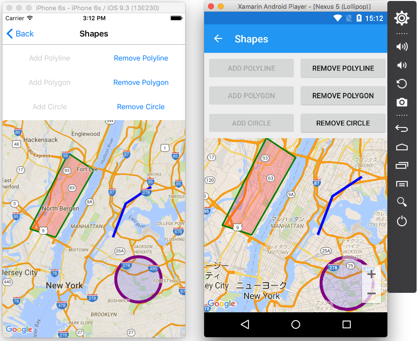

Xamarin.Forms.Maps との比較
---

Xamarin.Forms.Maps と比較して、追加された機能等について解説します。特に記載がない限り、Android / iOS のみの対応です。

## 追加された機能

### Polyline, Polygon, Circle のサポート(v1.1.0より)

共通のインターフェースで、ポリライン・ポリゴン・円を追加できます。



例えば、ポリラインの追加は以下のように行います。

```
// map as Xamarin.Forms.GoogleMaps.Map

var polyline = new Polyline();
polyline.Positions.Add(new Position(40.77d, -73.93d));
polyline.Positions.Add(new Position(40.81d, -73.91d));
polyline.Positions.Add(new Position(40.83d, -73.87d));

polyline.StrokeColor = Color.Blue;
polyline.StrokeWidth = 5f;
polyline.Tag = "POLYLINE"; // Can set any object

polyline.IsClickable = true;
polyline.Clicked += (s, e) => 
{
    // handle click polyline
};

map.Polylines.Add(polyline);
```

ラインの削除は、以下のように行います。

```
map.Polylines.Remove(polyline);
```

ポリラインとポリゴンは、 ``IsClickable`` を ``true`` に設定すると ``Clicked`` イベントを受け取ることができます。

円には、 ``IsClickable`` プロパティと ``Clicked`` イベントはありません。これは、 Android ネイティブの Google Maps API がサポートしていないためです。

詳しくは、サンプルプログラム − [XFGoogleMapSample](https://github.com/amay077/Xamarin.Forms.GoogleMaps/tree/master/XFGoogleMapSample) の [``ShapesPage.xaml.cs``](https://github.com/amay077/Xamarin.Forms.GoogleMaps/blob/v1.1.0/XFGoogleMapSample/XFGoogleMapSample/ShapesPage.xaml.cs) を参考にしてください。

#### 制限事項

* v1.1.0 では、``Pin``, ``Polyline``, ``Polygon``, ``Circle`` の各プロパティのバインディングはサポートしていません。 

### Pin の選択状態をプログラムから設定／取得(v1.0.0より)

``Map.SelectedPin`` に表示済みの ``Pin`` を設定すると、そのピンを選択状態とし、情報ウィンドウ(InfoWindow)を表示します。
``Map.SelectedPin``に ``null`` を設定すると、選択状態を解除し、情報ウィンドウ(InfoWindow)を閉じます。

詳しくは、サンプルプログラム − [XFGoogleMapSample](https://github.com/amay077/Xamarin.Forms.GoogleMaps/tree/master/XFGoogleMapSample) の [``PinsPage.xaml.cs``](https://github.com/amay077/Xamarin.Forms.GoogleMaps/blob/v1.1.0/XFGoogleMapSample/XFGoogleMapSample/PinsPage.xaml.cs) を参考にしてください。

## 変更された機能

### ``Map.MoveToRegion`` の引数に ``bool animate`` を追加(v1.1.0より)（Android / iOS / UWP 対応）

``animate`` を ``true`` に設定すると、移動時にアニメーションします。 ``false`` を設定するとアニメーションせずに即座に移動します。この引数は省略可能であり、省略時は ``true`` になります。

## 削除された機能

* なし（v1.1.0 現在）