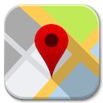
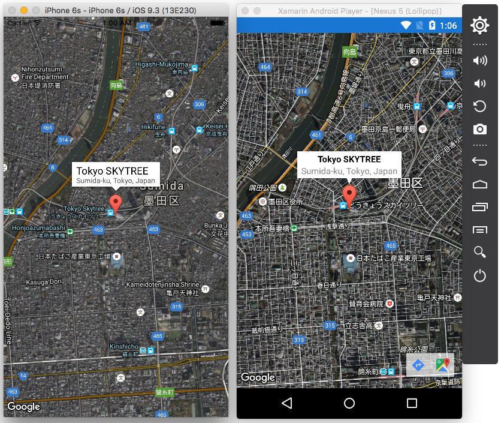

##  Xamarin.Forms.GoogleMaps 
  [](https://appcenter.ms) [](http://gitter.im/Xamarin-Forms-GoogleMaps/public) [](#寄付)

[English README is here！](README.md)

Xamarin.Forms 用の Googleマップライブラリです。

[Xamarin.Forms.Maps](https://github.com/xamarin/Xamarin.Forms) をフォークして作っているので、使い方はほとんど同じです。


## デモアプリ

このライブラリの全ての機能が試せるデモアプリを以下より配信しています。このアプリのソースは [XFGoogleMapSample](https://github.com/amay077/Xamarin.Forms.GoogleMaps/tree/master/XFGoogleMapSample) です。

* [Android DEMO Apps](https://install.mobile.azure.com/users/okuokuoku/apps/xfgooglemapsample/distribution_groups/trial) - このリンクをAndroidのブラウザで開いてください
* iOS DEMO Apps - [Gitter](https://gitter.im/Xamarin-Forms-GoogleMaps/public) かなにかでリクエストしてください（デバイスのUUIDを教えてもらう必要があります）



## なぜこれを作った

Xamarin公式の地図ライブラリ [Xamarin.Forms.Maps](https://developer.xamarin.com/guides/xamarin-forms/user-interface/map/) は、非常に機能が少ないです（Googleマップ、Appleマップ、Bingマップで機能を共通化するのはとても難しいのでしょう）。

特に感じるのは、BingマップSDKがとてもチープなことです。ベクトルタイルでもないし、マーカーの吹き出し(InfoWindow
)も無いようです。モバイルアプリの市場のほとんどは Android と iOS なのに、Bingマップのサポートは必要ないように感じます。また、iOS でも Appleマップ よりも Googleマップ を使用した方が、 Android/iOS で共通化しやすいと感じます。

このライブラリは、メインターゲットを iOS と Android だけに限定し、Xamarin.Forms.Maps でできない機能を実現するために作りました。

異なる地図SDKで実現可能な最小限の機能しか持たない Xamarin.Forms.Maps に対して、 **同じ Google Maps で多くの共通機能を実現できるのが Xamarin.Forms.GoogleMaps です。**

## Xamarin.Forms.Maps との比較

|機能|X.F.Maps|X.F.GoogleMaps|
| ------------------- | :-----------: | :-----------: |
|地図の種類|Yes|Yes|
|渋滞状況地図|-|Yes|
|地図イベント|-|Yes|
|地図の移動(アニメーション付き)|Yes|Yes|
|地図の移動(アニメーション無し)|-|Yes|
|ピン|Yes|Yes|
|カスタムピン|-|Yes|
|ピンのドラッグ&ドロップ|-|Yes|
|ポリゴン|-|Yes|
|ライン|-|Yes|
|円|-|Yes|
|カスタム地図タイル|-|Yes|


詳しくは、[Xamarin.Forms.Maps との比較](https://github.com/amay077/Xamarin.Forms.GoogleMaps/wiki/Xamarin.Forms.Maps との比較) を見て下さい。

## セットアップ

* Available on NuGet: https://www.nuget.org/packages/Xamarin.Forms.GoogleMaps/ [](https://www.nuget.org/packages/Xamarin.Forms.GoogleMaps/)
* PCLプロジェクトと各プラットフォームプロジェクトにインストールしてください

## サポートするプラットフォーム

|Platform|Supported|
| ------------------- | :-----------: |
|iOS Unified|Yes|
|Android|Yes|
|Windows 10 UWP|Yes (Bing map)|
|その他|No|

## 使い方

* [Map Control - Xamarin](https://developer.xamarin.com/guides/xamarin-forms/user-interface/map/)
* [Xamarin.Formsで地図を表示するには？（Xamarin.Forms.Maps使用） - Build Insider](http://www.buildinsider.net/mobile/xamarintips/0039)

とほぼ同じです。
初期化メソッドが ``Xamarin.Forms.Maps.Init()`` から ``Xamarin.Forms.GoogleMaps.Init()`` に変更になっています。

iOS の場合、 [Google Maps API for iOS](https://developers.google.com/maps/documentation/ios-sdk/) の API キーを取得し、``AppDelegate.cs`` にて ``Init`` に渡してください。

```csharp
[Register("AppDelegate")]
public partial class AppDelegate : global::Xamarin.Forms.Platform.iOS.FormsApplicationDelegate
{
    public override bool FinishedLaunching(UIApplication app, NSDictionary options)
    {
        global::Xamarin.Forms.Forms.Init();
        Xamarin.FormsGoogleMaps.Init("your_api_key");
        LoadApplication(new App());

        return base.FinishedLaunching(app, options);
    }
}
``` 

UWP の場合、 Xamarin.Forms.GoogleMaps.UWP.dll の Assembly を ``Xamarin.Forms.Forms.Init()`` に渡す必要があります。

```csharp
// App.xaml.cs
protected override void OnLaunched(LaunchActivatedEventArgs e)
{
    Frame rootFrame = Window.Current.Content as Frame;

    if (rootFrame == null)
    {
        rootFrame = new Frame();
        rootFrame.NavigationFailed += OnNavigationFailed;

        // Should add UWP side assembly to rendererAssemblies
        var rendererAssemblies = new []
        {
            typeof(Xamarin.Forms.GoogleMaps.UWP.MapRenderer).GetTypeInfo().Assembly
        };
        Xamarin.Forms.Forms.Init(e, rendererAssemblies);
        
        Xamarin.FormsGoogleMaps.Init("your_bing_maps_api_key");

        Window.Current.Content = rootFrame;
    }

    if (rootFrame.Content == null)
    {
        rootFrame.Navigate(typeof(MainPage), e.Arguments);
    }
    Window.Current.Activate();
}
```

既定の名前空間が ``Xamarin.Forms.Maps`` から ``Xamarin.Forms.GoogleMaps`` に変更されています。他のAPIはすべて同じです。

サンプルプログラムが、

* [XFGoogleMapSample](https://github.com/amay077/Xamarin.Forms.GoogleMaps/tree/master/XFGoogleMapSample)

にあります。

## 採用事例

Xamarin.Forms.GoogleMaps が使われているアプリを紹介します(他にもあったら [教えてください](https://github.com/amay077/Xamarin.Forms.GoogleMaps/issues/512))。

<table>
  <tr>
    <td align="center">
      <h3><a target="_blank" href="https://www.herenow.city/">HereNow</a></h3>
      
      <p>by <a target="_blank" href="https://www.cinra.co.jp/">CINRA, Inc.</a></p>
    </td>
    <td align="center">
      <h3><a target="_new" href="https://www.citybee.lt/">CityBee</a></h3>
      
      <p>&nbsp;</p>
    </td>
    <td align="center">
      <h3><a target="_new" href="https://itunes.apple.com/tr/app/rentacarss-ara%C3%A7-takip/id1276280125">Rentacarss Araç Takip</a></h3>
      
      <p>&nbsp;</p>
    </td>
    <td align="center">
      <h3><a target="_new" href="https://www.uspace.city/">UPSPACE</a></h3>
      
      <p>&nbsp;</p>
    </td>
  </tr>
  <tr>
    <td align="center">
      <h3><a target="_blank" href="https://itunes.apple.com/us/app/transantiagomaster/id541341697?mt=8">TransantiagoMaster</a></h3>
      
    </td>
    <td align="center">
      <h3><a target="_blank" href="https://play.google.com/store/apps/details?id=jp.co.Shin_yosha.NowStation">NowStation</a></h3>
      
      <p>by <a target="_blank" href="http://www.shin-yosha.co.jp/">新陽社</a></p>
    </td>
    <td align="center">
    </td>
    <td align="center">
    </td>
  </tr>    
</table>

## リリースノーツ

[Releases](https://github.com/amay077/Xamarin.Forms.GoogleMaps/releases) または [RELEASE_NOTES](RELEASE_NOTES.md) を見てください。

## 今後の予定

なるべく Xamarin.Forms.Maps の API に準じ、Google Maps固有の機能のみ API を追加するつもりです。 

機能要望は、 [@amay077](https://twitter.com/amay077) または、ISSUE やプルリクください！
追加機能案は以下の通りです。

* ~~Pin の InfoWindow の Visible プロパティ~~ v1.0.0で対応
* ~~Pin のタップ＆ホールドによる移動~~ v1.5.0で対応
* ~~Polygon, Polyline, Circle の描画サポート~~ v1.1.0で対応
* [その他の機能改善リスト](https://github.com/amay077/Xamarin.Forms.GoogleMaps/labels/enhancement)

Windows 10 UWP 対応は「とりあえず」残しました。
が、基本的には Android/iOS での Google Maps に最適化するので、UWP では未対応の機能が増えると予想されます。  

## CONTRIBUTION

私たちは、Xamarin.Forms.GoogleMaps への、あなたの貢献に大変感謝します。

開発に参加して頂ける方は、[コントリビューション ガイドライン](CONTRIBUTING-ja.md) を読んで下さい。

## 寄付

Xamarin.Forms.GoogleMaps 開発の継続のため、寄付を募集しています。

**Gumroad**

* [Gumroad](https://gum.co/xfgmdnate)

あなたの寄付で開発者のモチベーションが上がります、どうかよろしくおねがいします :sushi:

## ライセンス

[LICENSE](LICENSE.txt) をみて下さい。

logo.png by [alecive](http://www.iconarchive.com/show/flatwoken-icons-by-alecive.html) - [CC BY-SA 4.0](https://creativecommons.org/licenses/by-sa/4.0/deed)
